# P2_Probstat_C_5025201180
Pengerjaan Praktikum 2 dari mata kuliah Probabilitas dan Statistika 2022

| Nama                       | NRP        |
|----------------------------|------------|
| Nethaneel Patricio Linggar | 5025201180 |

 

## Soal 1

### Poin A
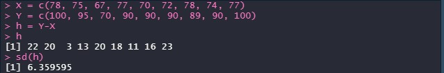
### Poin B
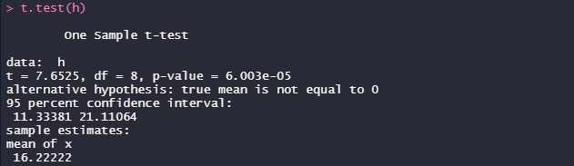
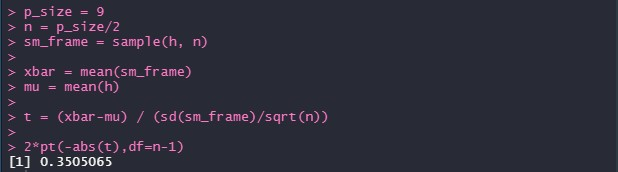
### Poin C
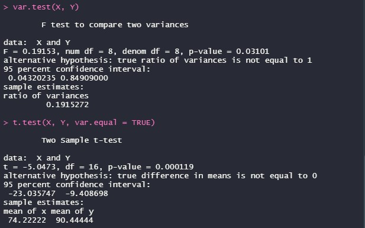

 

## Soal 2
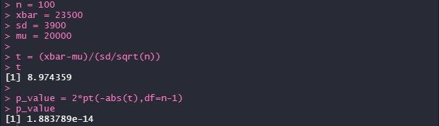
### Poin A
### Poin B
### Poin C

 

## Soal 3
### Poin A
### Poin B
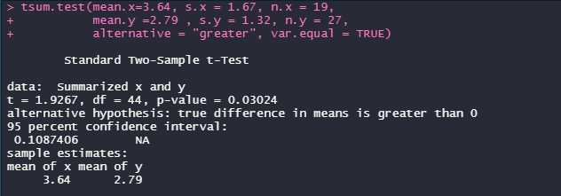
### Poin C
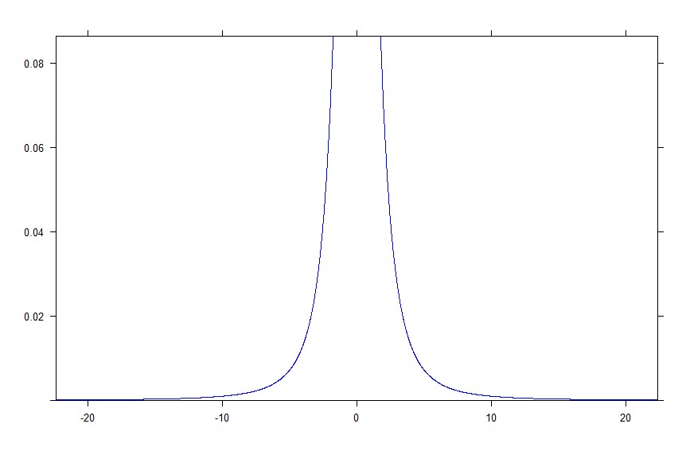
### Poin D

### Poin E
### Poin F

 

## Soal 4
### Poin A
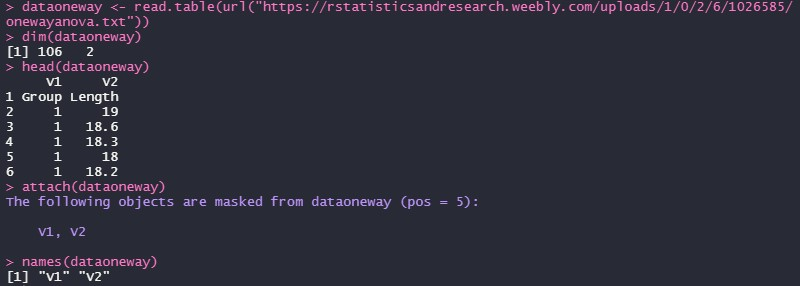
### Poin B
### Poin C

### Poin D
### Poin E
### Poin F

 

## Soal 5
### Poin A
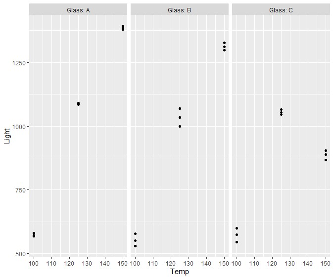
### Poin B
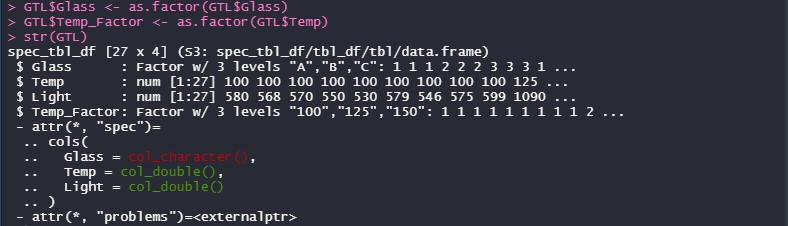
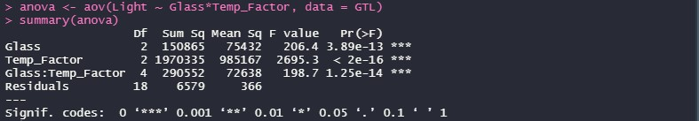
### Poin C
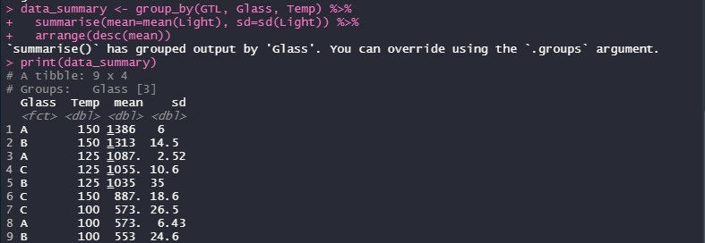
### Poin D
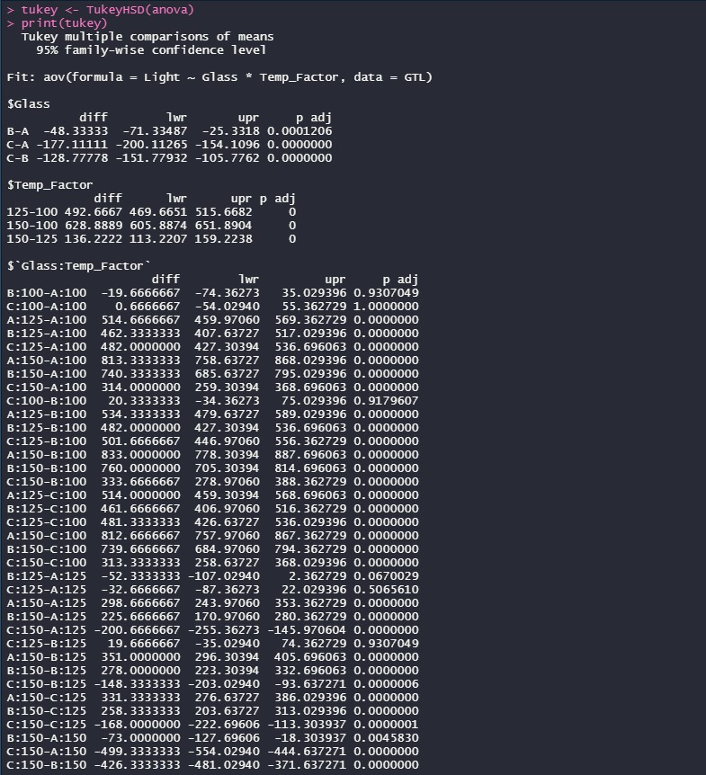
### Poin E
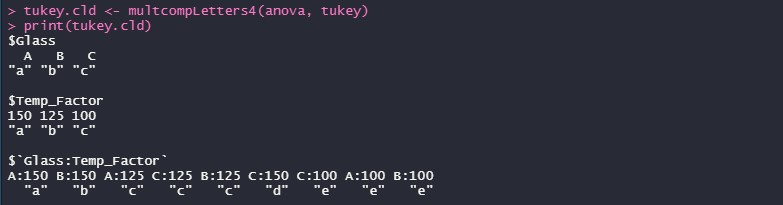
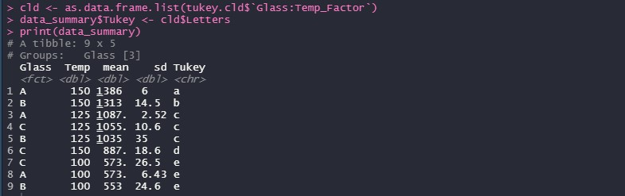